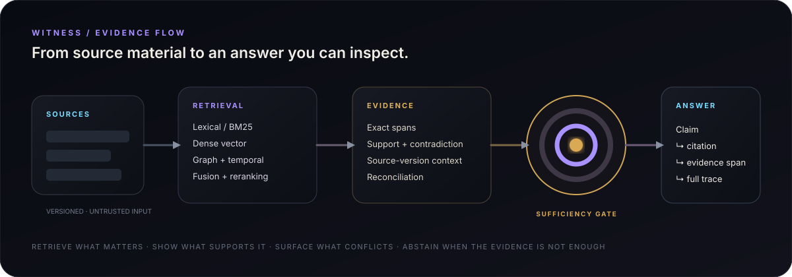

# Witness

> Evidence-first RAG workbench for answers that can be inspected, challenged, reproduced, and tested.

Witness is not a chat wrapper over a vector database. It is a local-first retrieval and evidence system built around a stricter question: **what evidence supports this answer, what contradicts it, how was it retrieved, and is the available evidence actually sufficient?**

The project is designed to make the hidden parts of retrieval-augmented generation visible. Every answer should be traceable from sentence -> evidence span -> source version -> retrieval path -> ranking decision.

<p align="center">
  
</p>

## Download

**Witness v1.1.1 is released for Windows, macOS and Linux.**

| Platform | Download |
|---|---|
| Windows 10/11 (x64) | [Witness_1.1.1_x64-setup.exe](https://github.com/purysho/Witness/releases/download/v1.1.1/Witness_1.1.1_x64-setup.exe) — current-user installer |
| macOS (Apple Silicon) | [Witness_1.1.1_aarch64.dmg](https://github.com/purysho/Witness/releases/download/v1.1.1/Witness_1.1.1_aarch64.dmg) |
| Linux (x86_64) | [Witness_1.1.1_amd64.AppImage](https://github.com/purysho/Witness/releases/download/v1.1.1/Witness_1.1.1_amd64.AppImage) · [Witness_1.1.1_amd64.deb](https://github.com/purysho/Witness/releases/download/v1.1.1/Witness_1.1.1_amd64.deb) |

- [SHA256SUMS.txt](https://github.com/purysho/Witness/releases/download/v1.1.1/SHA256SUMS.txt) · [Release page](https://github.com/purysho/Witness/releases/tag/v1.1.1) · [Release notes](RELEASE_NOTES_v1.1.1.md)

Every package includes the frozen Witness engine, so Python and a developer environment are not required. The builds are not yet code-signed: Windows SmartScreen may ask you to confirm the installer, and macOS may need you to Control-click the app and choose **Open** the first time.

Verify a download against the release's `SHA256SUMS.txt`:

```powershell
(Get-FileHash .\Witness_1.1.1_x64-setup.exe -Algorithm SHA256).Hash.ToLower()
```

```sh
shasum -a 256 Witness_1.1.1_aarch64.dmg        # macOS
sha256sum Witness_1.1.1_amd64.AppImage          # Linux
```

**Updates are manual.** Witness does not contact GitHub or another update service automatically. New releases are downloaded explicitly from GitHub Releases and can be verified with the published SHA-256 checksums. Automatic updating remains disabled until a signed update channel can preserve the same local-first and fail-closed guarantees.

## Core ideas

- **Evidence before fluency.** The system may abstain when the corpus does not justify an answer.
- **Sentence-level provenance.** Important answer sentences point to exact source spans, not merely documents.
- **Inspectable retrieval.** Lexical, dense, graph, temporal, hierarchical, and multimodal retrieval paths are visible in a trace.
- **Contradictions are first-class.** Conflicting evidence is surfaced rather than silently collapsed.
- **Versions matter.** Newer and superseded source versions remain distinguishable.
- **Evaluation is part of the product.** Retrieval, citation, faithfulness, contradiction handling, and abstention can be benchmarked.
- **Documents are untrusted input.** Source text cannot instruct the application or model to ignore system rules.

## V1 surfaces

| Surface | Purpose |
| --- | --- |
| **Library** | Import, inspect, version, and manage sources. |
| **Ask** | Ask questions and receive evidence-backed answers with sufficiency states. |
| **Trace** | Inspect routing, retrieval candidates, fusion, reranking, exclusions, and citations. |
| **Graph** | Explore claims, entities, sources, support edges, contradiction edges, and temporal relationships. |
| **Lab** | Run repeatable retrieval/RAG evaluations and A/B configuration comparisons. |
| **Attack** | Test prompt injection, poisoning, distractors, stale evidence, and conflicting-source failure modes. |

## Retrieval pipeline

```text
query
  -> query understanding
  -> retrieval strategy router
      -> lexical / BM25
      -> dense vector
      -> graph expansion
      -> temporal retrieval
      -> hierarchical retrieval
      -> multimodal retrieval
  -> rank fusion
  -> reranker
  -> evidence reconciliation
  -> sufficiency gate
  -> answer synthesis
  -> sentence-level citations + full trace
```

## Product boundary

Witness is an **evidence and retrieval workbench**, not a general-purpose autonomous agent and not a document instruction executor. Its job is to ingest sources, retrieve evidence, reconcile it, answer within the evidence boundary, and make the process inspectable.

## Documents

- [`SPECIFICATION.md`](SPECIFICATION.md) — product and functional specification
- [`ARCHITECTURE.md`](ARCHITECTURE.md) — technical architecture and data flow
- [`ROADMAP.md`](ROADMAP.md) — staged implementation plan
- [`SECURITY.md`](SECURITY.md) — threat model and source-safety rules
- [`V1_RELEASE_CHECKLIST.md`](V1_RELEASE_CHECKLIST.md) — acceptance criteria mapped to automated tests and release gates
- [`docs/evaluation.md`](docs/evaluation.md) — RAG Lab datasets, metrics, snapshots, comparison, and export semantics
- [`docs/attack-lab.md`](docs/attack-lab.md) — Attack Lab isolation, manifests, invariants, reproducibility, and export
- [`docs/multimodal.md`](docs/multimodal.md) — visual evidence identity, page-region provenance, asset storage, retrieval, evaluation, and viewer semantics
- [`docs/distribution.md`](docs/distribution.md) — Windows signing, SmartScreen, release metadata, and update policy
- [`CHANGELOG.md`](CHANGELOG.md) — release-by-release product changes

## Status

**Witness v1.1.0 is released.** V1 includes the full Library/Ask/Trace/Graph/Lab/Attack workflow, versioned mixed-format ingestion, provenance-safe multimodal evidence, cancellable jobs, fail-closed workspace recovery, secret-free provider configuration, the first-run demo, and Windows NSIS packaging. CI verifies Ubuntu/Windows engine tests, generated contracts, the desktop frontend, the Tauri host, frozen-engine persistence, and an installed desktop → bundled-engine RPC round trip. See [`V1_1_ROADMAP.md`](V1_1_ROADMAP.md) for the focused hardening backlog.
